# Binary I/O

[TOC]

## References

- Liang: Chp. 17, pp. 678 - 714
- Bloch: pp. 339 - 342
- [https://funnelgarden.com/java_read_file/](
https://funnelgarden.com/java_read_file/)
- [https://s3.amazonaws.com/cybersec-prod/secdev/wp-content/uploads/2017/06/27204835/Java-Deserialization-Vulnerabilities-and-Mitigations.pdf](
https://s3.amazonaws.com/cybersec-prod/secdev/wp-content/uploads/2017/06/27204835/Java-Deserialization-Vulnerabilities-and-Mitigations.pdf) (Further reading on serialization risks)

For more information on how to correctly serialize objects (i.e. other than just implementing the Serializable interface), read: Bloch, pgs. 343 - 366

## Binary Files

- **All files are binary files**
  - They just contain a bunch of numbers encoded in binary form
- Text files
  - The numbers can be interpreted as characters representing readable text
- Binary files
  - Can contain data, that if interpreted as characters, is nonprintable
  - Examples: image files, audio files, .class files, etc.

### Characteristics

- Usually smaller than a text file that contains an equivalent amount of data
- More efficient
- Storing values using numeric formats such as IEEE 754 tends to use less memory
- Offer advantages in terms of speed of access
- Can be difficult to understand, edit, etc.
  - You cannot assume that they are in groups of 8 bits

## Text I/O

- Text data can be read using `Scanner` and written using `PrintWriter`
- Text I/O is built on binary I/O
  - Provides a layer of abstraction for character encoding and decoding

### API Examples

```java
// Note: this variant of the Scanner constructor throws a checked exception
Scanner output = new Scanner(new File("tmp.txt")); // FileNotFoundException
output.print("Java 101");
output.close();

// Note: this variant of the PrintWriter constructor throws a checked exception
PrintWriter output = new PrintWriter("tmp.txt"); // FileNotFoundException
output.print("Java 101");
output.close();

PrintWriter output = new PrintWriter(System.out);
output.print("Java 101");
output.close();
```

- In general, if dealing with files, a checked `IOException` is likely involved
  - `FileNotFoundException` is an `IOException`
- `Scanner` constructor can also take a `String` argument
  - The argument will be the string to be scanned

### File Encodings

- JVM behaviors:
  - Converts Unicode to a file-specific encoding when writing a character
  - Converts a file-specific encoding to Unicode when reading a character
  - **In the US, the default encoding is ASCII**
- Example: Write the string "199" using text I/O
  - Character "1"
    - Unicode value is `0x0031` (hex)
    - ASCII code is 49 (also `0x31` hex)
  - Character "9"
    - Unicode value is `0x0039` (hex)
    - ASCII code is 47 (also `0x39` hex)
  - So 3 bytes are sent: `0x31`, `0x39`, `0x39`
- **If this were binary I/O, there would be no conversion for each value**
  - 199: 12 * 16 + 7 (`0xC7`)

## I/O Stream API

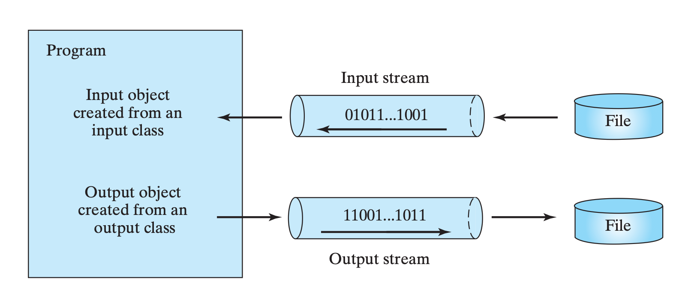

- **`InputStream`**: abstract root class for reading binary data
  - "Input object" in the infographic
- **`OutputStream`**: abstract root class for writing binary data
  - "Output object" in the infographic

### Class Hierarchy

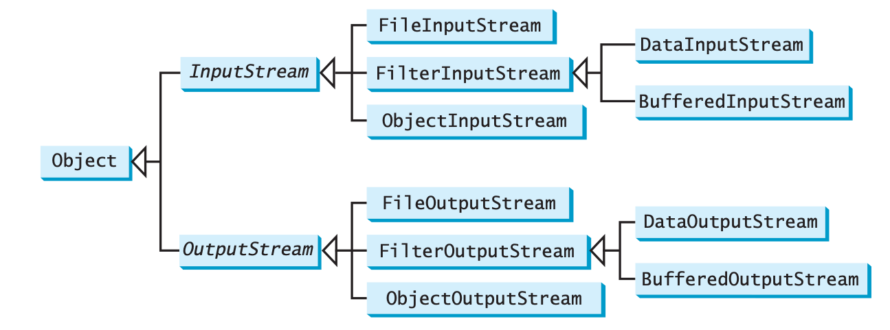

### `InputStream` methods

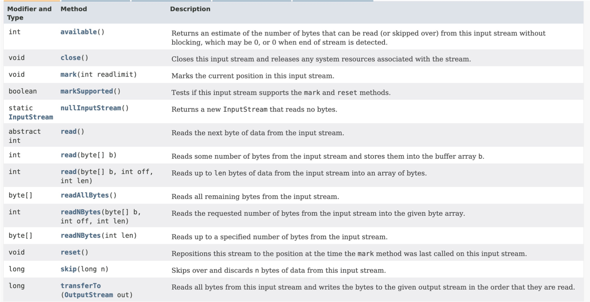

### `OutputStream` methods

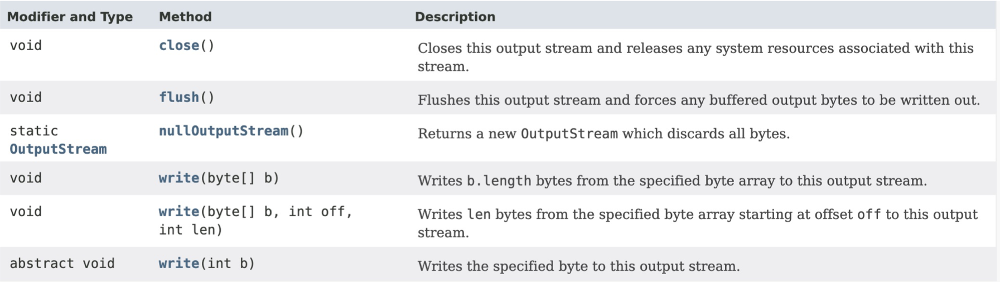

### `FileInputStream`

- Used to **read bytes from a file**

#### Constructors

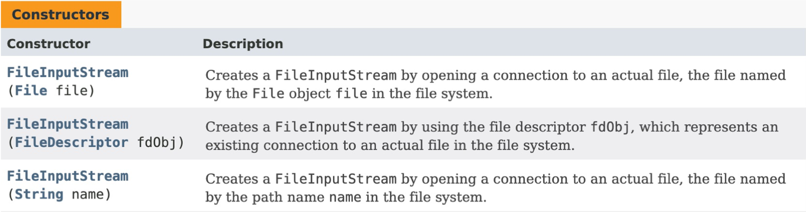

- `FileInputStream(File)` and `FileInputStream(String)` can throw either:
  - A checked `FileNotFoundException`, or
  - An unchecked `SecurityException`
    - Which extends `RuntimeException`, hence its unchecked nature
- `FileInputStream(FileDescriptor)` throws an unchecked `NullPointerException`

#### Methods

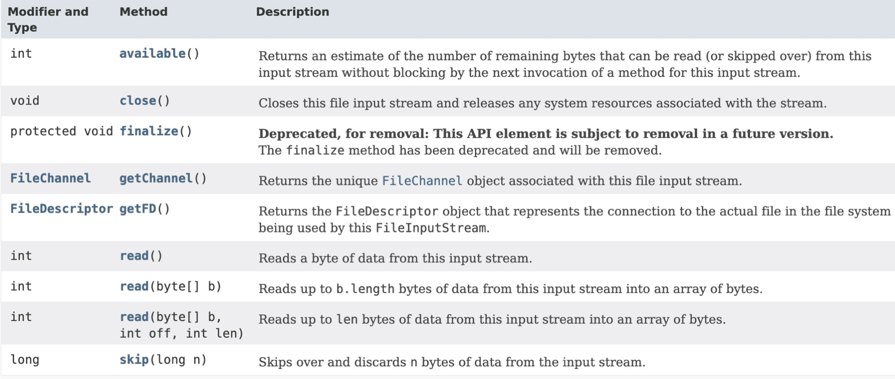

#### Usage Example

Suppose `data.dat` contains:
```text
This is some content
And some more content
And yaddah yaddah yaddah
```

```java
import java.io.File;
import java.io.FileInputStream;
import java.io.IOException;
import java.io.FileNotFoundException;

public class TestFileInput {
    public static void main(String[] args) {
        File file = new File("data.dat");

        // Note that this is a try-with-resources declaration
        try (FileInputStream fin = new FileInputStream(file)) {
            int value;
            while ((value = fin.read()) != -1) {
                // read() returns a byte, we can cast it to char
                System.out.print((char) value);
            }
        } catch (FileNotFoundException e) {
            // Note the order of how these exceptions are caught
            System.out.println("No file");
        } catch (IOException e) {
            e.printStackTrace();
        }
    }
}
```

- A try-with-resources block can be used to automatically close the resource
- Note that `FileNotFoundException` is caught before `IOException`
  - This is because `FileNotFoundException` is a child of `IOException`
- `FileInputStream()` can also be constructed with the file name as a `String`

### `FileOutputStream`

- Used to **write bytes to a file**

#### Constructors

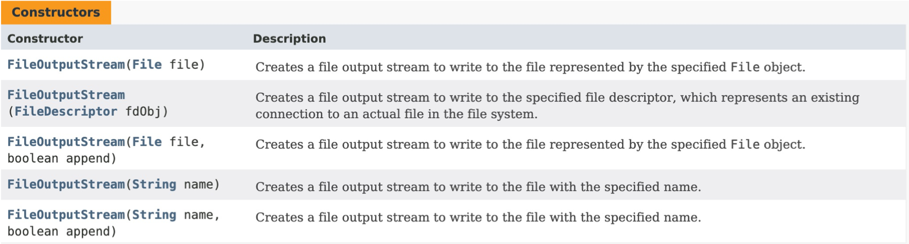

- Similar to `FileInputStream`, `FileNotFoundException` and `SecurityException`
can be raised.
- Note the **append** boolean flag
  - Useful if a file already exists and you want to add to it
  - if `append = true`, writing starts at the end of the file
  - if `append = false` (default), writing starts at the beginning of the file

#### Methods

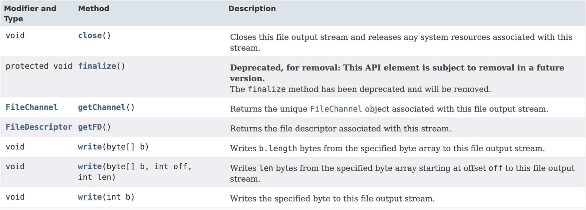

#### Usage Example

```java
import java.io.FileOutputStream;
import java.io.IOException;
import java.io.FileNotFoundException;

public class TestFileOutput {
  public static void main(String[] args) {
    String content = "This is the content\n";
    String content2 = "Additional content\n";

    try (FileOutputStream fout = new FileOutputStream("data2.dat")) {
      fout.write(content.getBytes());
      fout.write(content2.getBytes());
    } catch (FileNotFoundException e) {
      System.out.println("No file");
    } catch (IOException e) {
      e.printStackTrace();
    }
  }
}
```

Writes to `data2.dat`:
```text
This is the content
Additional content
```

## Filtered Streams

- Can be attached to another stream to filter or process data
  - As it is read from or written to the original stream
- Subclasses of `FilterInputStream` and `FilterOutputStream` in `java.io`:
  - `DataInputStream` / `DataOutputStream`
  - `BufferedInputStream` / `BufferedOutputStream`
  - `LinkedNumberInputStream`
  - `PushbackInputStream`
  - `PrintStream` (this is an output stream)
- Common practice to implement custom streams

### `DataInputStream`

- Useful for reading primitives, length-prefixed strings, etc.

#### Inheritance

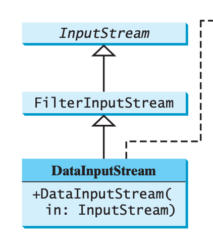

#### Constructors

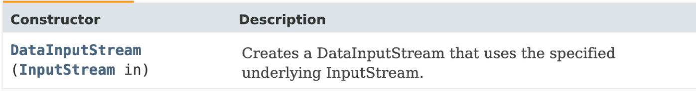

#### Methods

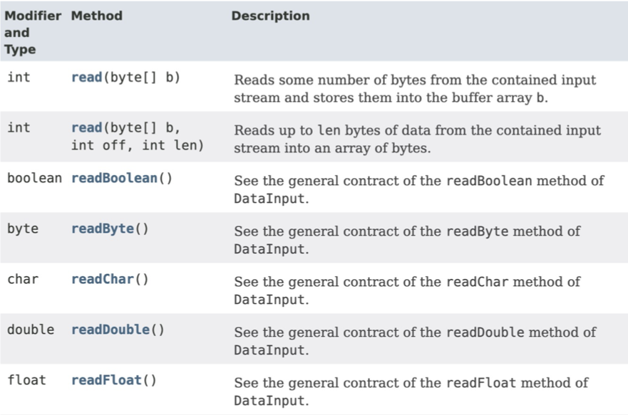
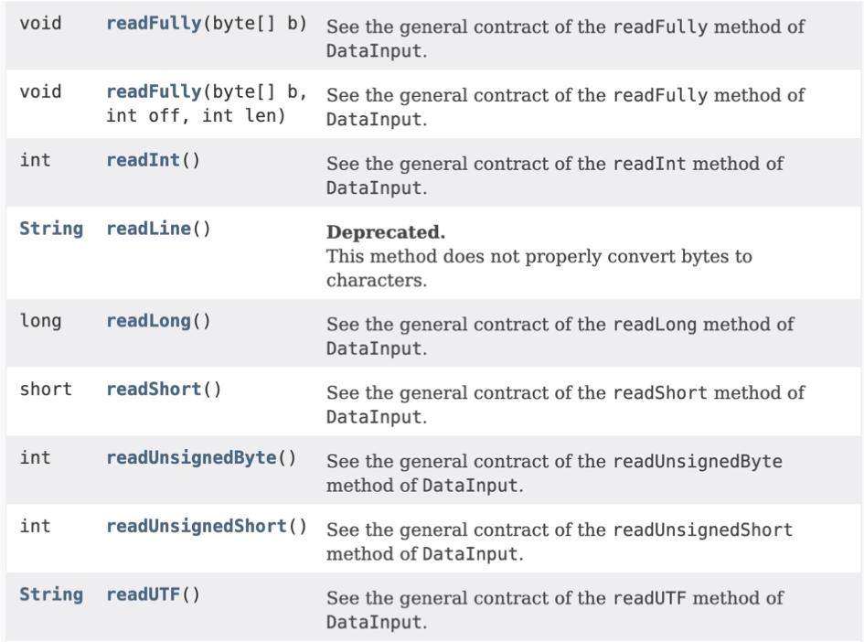

- Note that **readLine()** is deprecated
  - There are other, preferred ways to read a line of unknown size

#### Usage Example

```java
import java.io.DataInputStream;
import java.io.FileInputStream;
import java.io.IOException;
import java.io.FileNotFoundException;
import java.io.EOFException;

public class TestDataInput {
    public static void main(String[] args) {
        try (DataInputStream dis = new DataInputStream(new FileInputStream("invoice1.dat"))) {
            double price;
            int unit;
            try {
                while (true) {
                    price = dis.readDouble();
                    dis.readChar();       // throws out the tab
                    unit = dis.readInt();
                    dis.readChar();       // throws out the new line
                    System.out.println(unit + " units, " + "$" + price);
                }
            } catch (EOFException e) {
                System.out.println("All data read");
            }
        } catch (FileNotFoundException e) {
            System.out.println("No file");
        } catch (IOException e) {
            e.printStackTrace();
        }
    }}
```

### `DataOutputStream`

- Used to **write a stream of bytes**, not a stream of characters
  - This byte stream has the purpose of being efficiently and portably stored
  - You may not be able to read it with a regular text program
- Can write strings with `writeChars()`

#### Inheritance

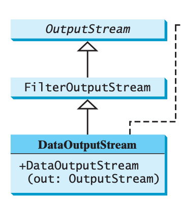

#### Constructors

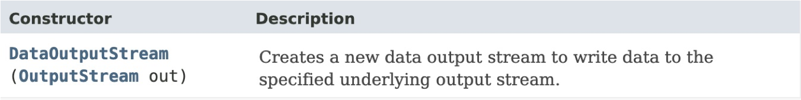

#### Methods

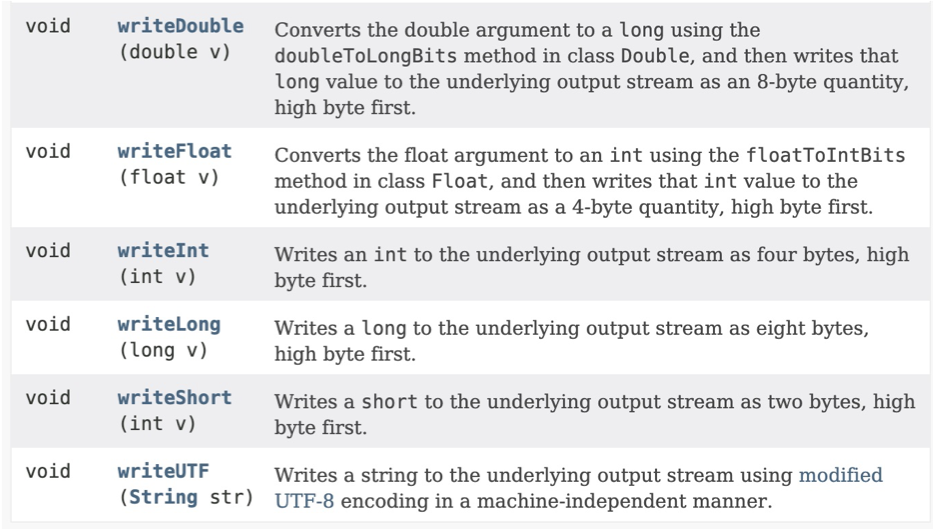
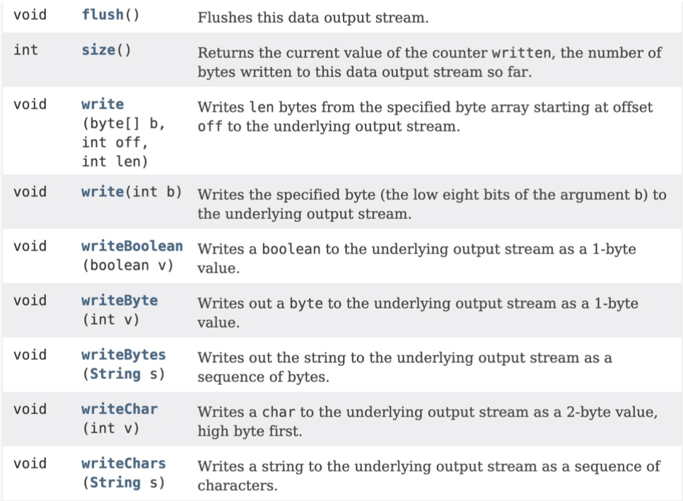

#### Usage Example

```java
import java.io.DataOutputStream;
import java.io.FileOutputStream;
import java.io.IOException;
import java.io.FileNotFoundException;

public class TestDataOutput
{
    public static void main(String[] args) {
        try (DataOutputStream dos = new DataOutputStream(new FileOutputStream("invoice1.dat"))) {
            double[] prices = { 19.99, 9.99, 15.99, 3.99, 4.99 };
            int[] units = { 12, 8, 13, 29, 50 };

            for (int i = 0; i < prices.length; i++) {
                dos.writeDouble(prices[i]);
                dos.writeChar('\t');
                dos.writeInt(units[i]);
                dos.writeChar('\n');
            }
        } catch (FileNotFoundException e) {
            System.out.println("No file");
        } catch (IOException e) {
            e.printStackTrace();
        }
    }
}
```

### `BufferedInputStream` and `BufferedOutputStream`

- Can speed up input and output by reducing the # of disk reads and writes
- Reading
  - The whole block of data on the disk is read into the buffer in memory once
  - The individual data is then delivered to your program from the buffer
- Writing
  - The individual data are first written to the buffer in memory
  - When full, all data in the buffer is written to the disk once
- No new methods in these classes
  - Just the inherited ones from `InputStream` and `OutputStream`
- Both classes manage a buffer behind the scene
  - Automatically reads/writes data from/to disk on demand
- **Should be used to speed up I/O**
  - For small files, performance improvements may not be noticed
  - For large files, e.g. > 100 MB, substantial improvements

#### Inheritance

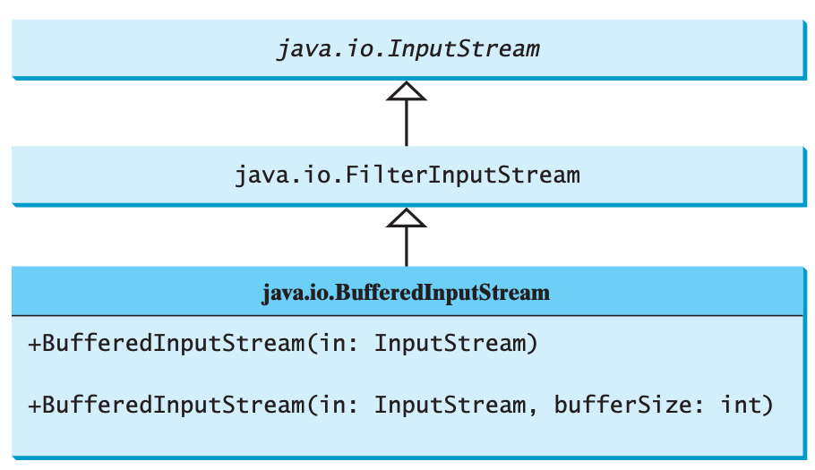
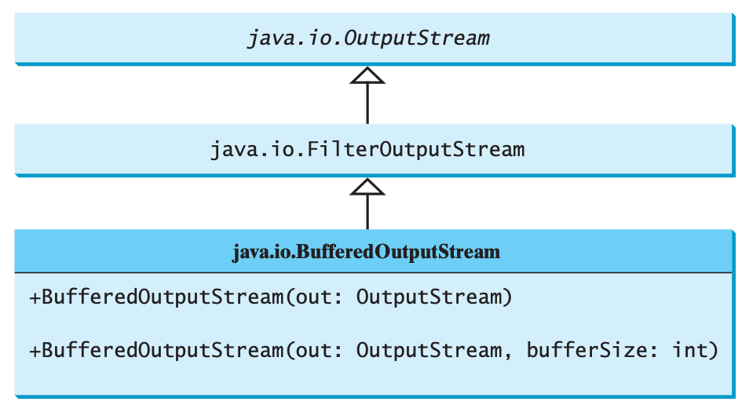

## Performance Benchmarks

### Read Performance

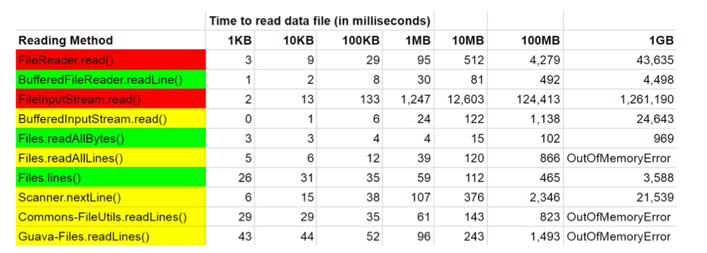

- NIO (`java.nio`, "New I/O") had the best winner (`File.readAllBytes()`)
- `BufferedReader.readLine()` is a close second
  - Proven top performer across the board
- `Files.lines(Path)` also an excellent performers
  - Slightly worse for smaller files, but excelled with larger files

## Object I/O

- `ObjectInputStream` and `ObjectOutputStream`
  - Can be used to read/write serializable objects

### `ObjectInputStream`

- Extends `InputStream`, implements `ObjectInput` and `ObjectStreamConstants`
- When reading objects, they must be cast to the correct type
- Note that `readObject()` can also throw a checked `ClassNotFoundException`

#### Inheritance

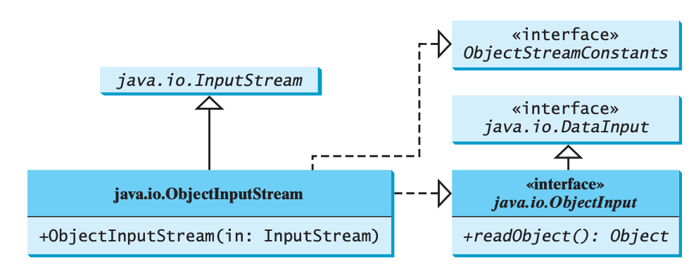

### `ObjectOutputStream`

- Extends `OutputStream`, implements `ObjectOutput` and `ObjectStreamConstants`
- Only objects that implement `java.io.Serializable` can be written to streams

#### Inheritance

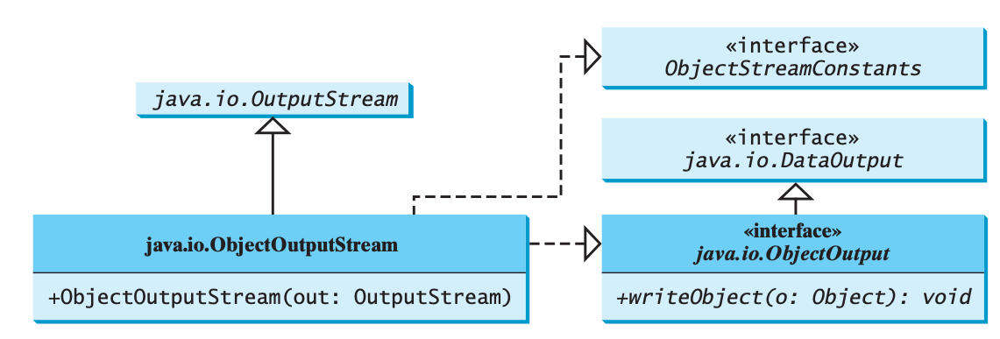

### Serializable Objects

- Objects that can be written to an output stream
- Instances of `java.io.Serializable` (must implement)
- Implementing `Serializable`
  - `Serializable` is a **marker interface** - it has no methods
  - Enables the Java serialization mechanism to automate the process of storing objects/arrays

### Serialization

- The class of each serializable object is encoded, including:
  - The class name
  - The class signature
  - The values of the object's fields and arrays
  - The closure of any other objects references from the initial objects
- The values of static variables are not stored
- Use the `transient` keyword to tell the JVM to ignore data fields when writing an object to an object stream
- An array is serializable if all its elements are serializable
- If trying to store an object that does not support support `Serializable`, a `NotSerializableException` is thrown

#### Duplicate Objects

- When an object is written for the first time, a serial number is created for it
- The JVM writes the complete contents of the object along with the serial number into the object stream
- After the first time, only the serial number is stored if the same object is written again
- When the objects are read back in, their references are the same since only one object is actually created in memory

#### Serialization Example With `ObjectOutputStream`

```java
import java.io.IOException;
import java.io.FileNotFoundException;
import java.io.FileOutputStream;
import java.io.BufferedOutputStream;
import java.io.ObjectOutputStream;
import java.util.Date;

public class TestObjectOutput
{
    public static void main(String[] args) throws IOException {
        try (FileOutputStream fout = new FileOutputStream("objdata.dat");
               BufferedOutputStream bout = new BufferedOutputStream(fout);
               ObjectOutputStream out = new ObjectOutputStream(bout);)
        {
              out.writeUTF("John");
              out.writeDouble(85.5);
              out.writeObject(new Date());
        } catch (FileNotFoundException e) {
              System.out.println("No file found");
        }
    }
}
```

#### Deserialization Example With `ObjectInputStream`

```java
import java.io.IOException;
import java.io.FileNotFoundException;
import java.io.FileInputStream;
import java.io.BufferedInputStream;
import java.io.ObjectInputStream;
import java.util.Date;

public class TestObjectInput
{
    public static void main(String[] args) throws IOException {
        try (FileInputStream fin = new FileInputStream("objdata.dat");
               BufferedInputStream bin = new BufferedInputStream(fin);
               ObjectInputStream in = new ObjectInputStream(bin);)
        {
              String name = in.readUTF();
              double score = in.readDouble();
              Date date = (Date) in.readObject();
            System.out.println(name + " " + score + " " + date);
        } catch (FileNotFoundException e) {
              System.out.println("No file found");
        } catch (ClassNotFoundException e) {
              e.printStackTrace();
        }
    }
}
```

### Serialization Concerns

- Serialization security is a very extensive topic
- When serialization was added to Java in 1997, it was known to be somewhat risky
- Risks
  - Invisible constructors
  - Blurred lines between API and implementations
  - Correctness
  - Performance
  - Security
  - Maintenance
- Example: Ransomware attack against railway operator (SFMTA Muni) shut down entire fare collection system for 2 days in Nov 2016

"The best way to avoid serialization exploits is never to deserialize anything."
~ Joshua Bloch

#### Attack Surface

The **attack surface** of a software environment is the sum of the different points
(the "attack vectors") where an unauthorized user (the "attacker") can try to
enter data to or extract data from an environment.

- `readObject()`: Essentially a magic constructor that can be made to instantiate objects of almost any type on the class path and can execute code from any of these types, so the code for all of these types is part of the attack surface.

- Gadgets: Methods invoked during deserialization that perform potentially dangerous activities. Can be used to create a gadget chain when used together that then allows an attacker to execute arbitrary native code on the underlying hardware.

#### Deserialization

- Dangerous as it is widely used both directly by applications and indirectly by Java subsystems
- Indirect use in Java
  - RMI (Remote Method Invocation)
  - JMX (Java Management Extension)
  - JMS (Java Messaging System)
- Deserialization of untrusted streams can result in:
  - Remote code execution (RCE)
  - Denial-of-service (DoS)
  - Range of other exploits
- Applications can be vulnerable to these attacks even if they did nothing wrong

~ Robert Seacord (2017)

### Serialization Alternatives

- JSON and Protocol Buffers (aka protobuf).
- If you have to deserialize, **never deserialize untrusted data**
- Use the object deserialization filtering added in Java 9 (backported to earlier releases)
  - Lets you specify a filter that is applied to data streams before they're deserialized.
- Blacklisting: Accepting class by default and rejecting a list of potentially dangerous ones.
- Whitelisting: Rejecting classes by default and accepting a list of those that are presumed safe.
- **Prefer whitelisting to blacklisting**

## Random-access Files

- A random-access file consists of a sequence of bytes
- A special marker called a **file pointer** is positioned at one of these bytes
  - A read or write operation takes place at the location of the file pointer
  - When a file is opened, the file pointer is set at the beginning of the file
- As opposed to sequential-access-files
  - Files that are opened using a sequential stream
  - The content cannot be updated - just read-only or write-only

### RandomAccessFile
- `RandomAccessFile`: A class that allows data to be read from and written to at any location in the file
  - Implements the `DataInput` and `DataOutput` interfaces
  - Fairly slow
- Specificy one of two modes (or both):
  - `r`: read
  - `w`: write
  - `rw`: read and write

#### Infographic

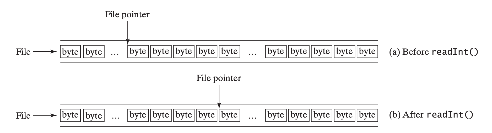

#### JavaDoc

[Java 11](https://docs.oracle.com/en/java/javase/11/docs/api/java.base/java/io/RandomAccessFile.html)

#### Write Example

```java
import java.io.RandomAccessFile;
import java.io.IOException;

public class RandomAccessFileDemo
{
  public static void main(String args[]) {
    String data = "Insert magic words here";
    writeToRandomAccessFile("random.dat", 100, data);
    System.out.println("String written into RandomAccessFile from Java Program : " + data);
  }

    public static void writeToRandomAccessFile(String file, int position, String record) {
    try (RandomAccessFile fileStore = new RandomAccessFile(file, "rw"))
    {
      // moves file pointer to position specified
      fileStore.seek(position);

      // writing String to RandomAccessFile
      fileStore.writeUTF(record);

     } catch (IOException e) {
      e.printStackTrace();
     }
  }
}
```

#### Read Example

```java
import java.io.RandomAccessFile;
import java.io.IOException;
import java.io.EOFException;

public class RandomAccessFileDemo
{
  public static void main(String args[]) {
    String fromFile = readFromRandomAccessFile("random.dat", 100);
    System.out.println("String read from RandomAccessFile in Java : " + fromFile);
  }

    public static String readFromRandomAccessFile(String file, int position) {
    String record = null;
    try (RandomAccessFile fileStore = new RandomAccessFile(file, "rw"))
    {
      // moves file pointer to position specified
      fileStore.seek(position);

      // reading String from RandomAccessFile
      record = fileStore.readUTF();

    } catch (EOFException e) {
      e.printStackTrace();
    } catch (IOException e) {
            System.out.println("All data read");
        }

    return record;
  }
}
```
